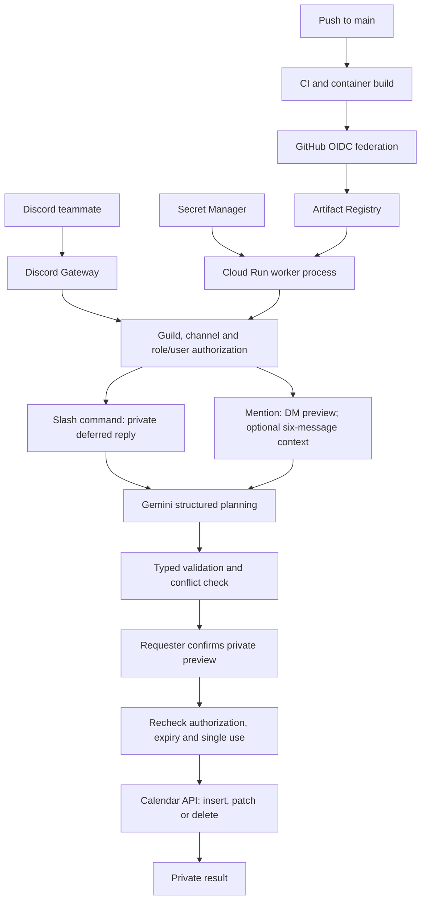

# Architecture

## Purpose and deployment shape

One Python 3.14 process connects outbound to Discord's Gateway, parses authorized scheduling requests with Gemini, and uses OAuth to manage a single Google Calendar. Cloud Run **worker pools** fit the persistent Gateway connection and background processing; no public HTTP endpoint or webhook ingress is required. Deployment explicitly requests one instance.

## Source structure

| Path | Responsibility |
| --- | --- |
| `bot/config.py` | Environment loading, timezone validation, deny-by-default allowlists |
| `bot/main.py` | Discord lifecycle, slash commands, mentions, bounded context, private previews, cooldowns and confirmation views |
| `bot/planner.py` | Google Gen AI client, system instruction, structured output, untrusted-context boundary |
| `bot/models.py` | Strict plan schema, writable field allowlist, timestamp/duration validation, one-hour default |
| `bot/service.py` | Prepare a proposal without writing; select exact event, reject unsupported event types, retain ETag |
| `bot/calendar.py` | OAuth HTTP session, paginated reads, conflicts, conditional writes, sanitized errors |
| `scripts/link_google.py` | Local Desktop OAuth browser flow and private refresh-token file |
| `scripts/check_secrets.py` | CI check for tracked credential files and common secret formats |
| `tests/` | Mocked security, scheduling, HTTP, and Discord behavior tests |
| `Dockerfile` | Non-root worker image with explicitly copied application files |
| `.github/workflows/` | Unprivileged PR checks and main-only federated deployment |

## Request processing

Discord-facing replies use a Dobby-inspired voice through fixed presentation text in `bot/main.py`.
This adds no model calls: the planner still returns structured scheduling data, and calendar titles,
descriptions, timestamps, permissions, and confirmation behavior are not rewritten for the persona.

1. Reject other servers, unauthorized users/roles, and disallowed channels before Calendar or Gemini calls. There is no implicit access for Discord administrators. Mention context additionally requires an explicitly configured channel and current membership with View Channel/Read Message History.
2. Acknowledge slash commands privately before slow API work. Mentions open a DM before fetching context; blocked DMs do not result in a public calendar preview.
3. Explicit context language causes a REST history read of at most six previous messages in the same text channel, excluding bots. Only text and timestamps are passed to Gemini, with a 1,500-character limit per message. Normal complete requests do not read history. No attachments, links, or other channels are fetched. Discord's message cache is disabled.
4. Updates/deletes require an explicit event ID supplied by the requester. The application fetches that event from the fixed configured calendar. Gemini cannot select a different calendar, choose an event ID, change credentials, or call arbitrary tools.
5. Gemini receives the request, current team-local time, optional bounded history, and only the selected event's relevant fields. It returns a Pydantic-validated operation. Calendar/history text is designated untrusted data. Prompt instructions are a parsing aid, not the security boundary.
6. Application code allows only title, start/end, description and location writes. It validates aware timestamps, positive duration of at most 24 hours, future starts, supported event types and required fields. A missing create end defaults to one hour after start. Missing/ambiguous title/date/time requests return a clarification. No write occurs in planning.
7. The private proposal includes the exact operation, event title/times and changed fields. The requester confirms within two minutes. Mention confirmations fetch current server membership and roles again because DM interaction payloads have no guild context; slash confirmations use the fresh guild interaction payload.
8. The write is queued through one thread executor, keeping the event loop responsive and serializing Calendar access. Relevant conflicts are checked again immediately before writing. PATCH/DELETE include the previewed ETag in `If-Match`; a changed event fails with 412 instead of being overwritten.
9. The result stays private. Creates use a deterministic SHA-256 event ID derived from the Discord request ID, which is valid Calendar base32hex syntax. The view is consumed before awaiting a write to prevent duplicate clicks. A new user request has a new ID; uncertain network results require checking the calendar before retrying.

## Security and trust boundaries

The Discord allowlist grants delegated bot access to the **whole configured team calendar** for supported operations. It does not sign users into Google, expose refresh tokens, or alter calendar ACLs. Existing Google sharing and invitee access are independent and remain governed by Google.

The runtime Google service account has Secret Accessor only on the three application secrets. It has no user-calendar identity of its own; user Calendar access comes from the locally authorized OAuth refresh token. The OAuth scope is `calendar.events`, not Gmail, Drive, or calendar-sharing administration. That scope can reach multiple calendars belonging to the linked account, so a dedicated Google account with access only to the intended calendar is the strongest isolation for a compromised token.

GitHub deployment uses OIDC restricted to the repository's numeric ID and owner ID, `main`, the production environment, and the named deploy workflow. The deploy service account can deploy workers and push images, and can act as the runtime service account. It has no direct Secret Accessor grant. **Anyone able to deploy arbitrary runtime code can nevertheless obtain runtime secrets**; trusted main-branch maintainers and Google project administrators are part of the trusted computing base. Protect main, workflow changes, environment settings, IAM, and Discord role assignment accordingly.

Secrets are excluded from Git and Docker contexts; Docker copies only dependency metadata and `bot/`. GitHub's generated temporary credentials are also ignored. Runtime errors expose only controlled messages/status codes; raw SDK exceptions and message bodies are not logged by application handlers. Do not enable SDK debug logging in production.

Free-tier Gemini is an external data processor whose terms permit product improvement use. Context and selected event text leave Discord/Google Calendar for Gemini. Restrict participating channels and use suitable account/tier terms for sensitive teams. Authorized recipients can retain or forward DM/ephemeral content; private responses are not DRM.

## Persistence, failure handling and limits

Google Calendar is the event store. No application database, history archive, token database, or conversation memory exists. OAuth access tokens refresh in memory from a read-only Secret Manager token mount. Relinking creates a new refresh-token secret version; restart/redeploy to use it.

Proposals and cooldowns are in-memory and are lost on restart. Pending confirmations intentionally stop working after deploy. A ten-second per-user cooldown and four-job bound reduce API pressure. Network clients have timeouts; the Discord connection remains responsive while synchronous API work executes in the worker thread.

Only one process/instance is supported. Cloud Run revisions may briefly overlap while rolling out; create IDs reduce duplicate insertion risk for the same Discord request, but this is not a distributed exactly-once system. Do not run a local copy and cloud copy with the same token. Before high-volume/multi-instance expansion, introduce a durable operation ledger, distributed locking, and leader election or Discord sharding.

Calendar conflict checks cannot be atomic with external calendar writers. The bot does not inspect each attendee's availability, schedule recurring events, or manage guest lists. Keep these limits explicit instead of allowing Gemini to imply that unsupported operations succeeded.

## Delivery and verification

PR jobs have read-only repository permissions and no cloud identity. Pushes to main run checks before the deployment job, build before obtaining federated credentials, push a commit-SHA image, then deploy with secret references and non-secret environment configuration. Secrets never enter image build arguments.

Automated tests mock external APIs and cover permission rejection, confirmation ownership/expiry/revocation, duplicate clicks, time validation/defaults, stale writes, pagination, conflict handling, and mention privacy/context. Real OAuth, model parsing, Discord permissions, and cloud rollout still require the documented live smoke test with the owner's credentials.
