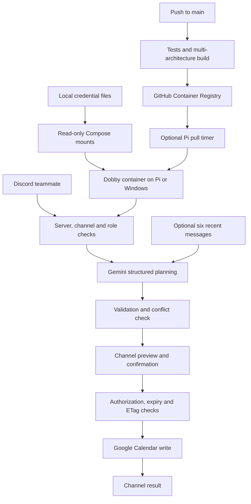

# Dobby architecture

## Runtime

One Python 3.14 process runs in a Linux Docker container on Windows Docker Desktop (`linux/amd64`) or a 64-bit Raspberry Pi (`linux/arm64`). Outbound Discord Gateway and HTTPS connections handle requests, Gemini planning, and Google Calendar. The normal runtime has no published ports.

The Dockerfile stages are `base` (dependencies and `bot/`), `test` (adds `pyproject.toml`, `scripts/` and `tests/`), and `runtime`. `runtime` is last so a bare `docker build .` selects it, and `publish.yml` pins `target: runtime`; the deployed image therefore never contains the test suite.

## Source structure

| Path | Responsibility |
| --- | --- |
| `bot/config.py` | Load local/mounted dotenv; validate settings and allowlists |
| `bot/main.py` | Discord lifecycle, mentions/context, commands, channel confirmations |
| `bot/voice.py` | Dobby's voice: `say(key)` reads `bot/responses/<key>.txt` (20 phrasings each) on every call and picks one at random; nothing is cached |
| `bot/planner.py` | Gemini structured output with context treated as untrusted data |
| `bot/lookup.py` | Fuzzy title search over upcoming editable events for update/delete without an ID |
| `bot/contacts.py` | Name -> email memory (`data/contacts.json`) and the reply parser for Dobby's email questions |
| `bot/models.py` | Writable field schema, time validation, duration/default/timezone rules |
| `bot/service.py` | Prepare without writing; exact event selection and ETags |
| `bot/calendar.py` | OAuth HTTP, pagination, conflicts, conditional writes, sanitized errors |
| `scripts/link_google.py` | Desktop OAuth loopback authorization, directly or through Docker |
| `scripts/check_secrets.py` | Baseline tracked-file credential guard |
| `scripts/bootstrap.py` | Create `.env`/`secrets/` before first run; repair Docker-created directories |
| `scripts/update-pi.sh` | Locked pull/recreate of configured registry image |
| `compose.yaml` | Secure local runtime for both platforms |
| `compose.auth.yaml` | One-shot OAuth helper with loopback-only host callback |
| `compose.registry.yaml` | Optional published-image override |
| `compose.test.yaml` | Offline test/lint services built from the Dockerfile `test` stage |
| `deploy/` | Optional systemd Pi update timer |
| `.github/workflows/` | PR checks and main-only image publication |
| `tests/` | Mocked behavior/security tests |

## Request lifecycle

1. Reject other servers, unauthorized users/roles and channels before calling Google/Gemini. No administrator bypass. Mention context also requires current membership and View Channel/Read Message History in the requesting channel or thread. `MENTION_CHANNEL_IDS` narrows mentions to named channels; empty permits any visible channel, mirroring `ALLOWED_CHANNEL_IDS`, so the message content intent is always requested and the user/role allowlist remains the access boundary.
2. Defer slash responses publicly. For mentions, reply in the originating channel or thread before fetching context. No DMs are sent; previews and results are visible to everyone with access there. Previews are inline text with 🟢/🔴 reactions; only the requester's reaction within two minutes is honoured, and a raw reaction handler re-authorizes them before writing.
3. Mentions always gather at most twelve preceding same-channel messages with author display names, plus the channel and thread names, so Gemini infers a title before clarifying. Bots are excluded and each text is limited to 1,500 characters. No attachments, linked pages, other channels or archives. Discord's message cache is disabled.
4. Updates/deletes fetch the user-supplied exact event ID from the fixed calendar. Gemini cannot choose another calendar or arbitrary event ID.
5. Gemini sees current team-local time, the request, recent channel context, the channel/thread names and selected event fields. Typed validation only permits title, start/end, description and location operations.
6. Validate future aware timestamps, positive duration up to 24 hours and supported event types. New meetings default to one hour; moved meetings preserve duration. Clarify missing/ambiguous details. No write occurs during planning.
7. Show a two-minute single-use channel confirmation restricted to its requester. Mention buttons fetch current guild roles and recheck private thread membership; slash buttons check the fresh interaction membership. Dobby's voice is fixed presentation text: no extra AI call, no rewriting Calendar fields.
8. Serialize API work through one bounded executor. Recheck conflicts before writes. PATCH/DELETE carry `If-Match` with the preview ETag; stale events fail. Creates use a deterministic SHA-256 ID based on the Discord request.
9. Consume the view before awaiting a write, preventing double-click duplication. Report results in the originating channel or thread. After uncertain network failures users must inspect `/events` before issuing another request.

## Secrets and access boundaries

Local `.env` contains API credentials and settings; `secrets/google-token.json` contains OAuth credentials. Compose mounts both read-only. `DOBBY_ENV_FILE` selects the mounted dotenv, and an explicit environment override selects the mounted token path. Credential values do not enter image build arguments or Compose container environment configuration. Dotenv interpolation is disabled to preserve literal credential characters; explicit process environment values take precedence.

Compose secrets are local bind-backed files, not encrypted storage. On Pi match the container UID/GID to their owner, with files mode `600` and directory mode `700`. On Windows use account ACLs. The runtime is non-root with all capabilities dropped, no published ports, a read-only filesystem, and bounded memory/logs. Host root, Docker administrators, and deployed code can still read secrets.

The OAuth helper is a separate Compose project so it can run before a token exists. It mounts the secrets directory writable and publishes port 8765 only on host loopback. Its internal listener binds all container interfaces so Docker forwarding works, while the Google redirect URI remains localhost. The SDK validates OAuth state; the flow times out after five minutes and writes credentials without printing them. A headless Pi receives the token through SCP after Windows authorization.

Discord allowlists delegate management of all supported events in the configured calendar, without granting Google login access or changing calendar ACLs. The OAuth `calendar.events` scope can reach other calendars accessible to the account. A dedicated Google account limits the impact of token compromise.

Errors do not log raw API bodies, prompts, event details or credentials. Operation logs contain Discord actor/server IDs. Free-tier Gemini may use data for product improvement; channel participation and meeting sensitivity must suit the API terms.

## Image delivery and update trust

Main pushes verify code and publish AMD64/ARM64 images with GitHub's built-in token. No cloud key or bot credentials are needed. Public package visibility enables anonymous Pi pulls; PR checks have no registry-write permission.

The optional Pi timer runs a trusted local updater as root for Docker access, pulling before replacing and using `flock` to prevent overlap. Failed pulls preserve the current container; bad images are not automatically rolled back. It does not automatically pull Git: Compose and updater files change through deliberate checkout updates. Only trusted administrators may edit that checkout, and only trusted maintainers may publish images; either can deploy code that accesses secrets.

Updates replace the single container, briefly reconnect Discord and invalidate previews. Windows manual pulls use the same registry override. No external deployment endpoint, self-hosted Actions runner, or container-mounted Docker socket is used.

## Cloud deployment status

The runtime is host-agnostic and already satisfies what a cloud platform needs: it configures entirely from environment variables (`load_dotenv` runs with `override=False`, so injected variables win over any `.env`), opens no listening port, writes nothing to disk, and refreshes access tokens in memory only. A read-only root filesystem and no persistent volume are sufficient.

A working deployment existed and was removed: `.github/workflows/deploy.yml` at the initial commit deploys a Cloud Run **worker pool** — the correct primitive for a gateway bot with no HTTP port — with `--instances 1` and the OAuth token mounted as a file via `--set-secrets '/secrets/google-token.json=…'`. Recovering it is a workflow change; the application code needs none.

Three things still need doing before that path is live again:

- **Restore and update the workflow.** It predates the multi-stage Dockerfile, so its build step should pin `target: runtime`, matching `publish.yml`.
- **Provide the OAuth token as a file.** `GOOGLE_TOKEN_FILE` must point at a real file; the token is the one setting that cannot be an environment variable. This requires a platform that mounts secrets as files.
- **Pin the instance count to exactly one.** Per-user cooldowns are a process-local dict and confirmations are non-persistent `discord.ui.View` objects, so a second replica would duplicate gateway traffic and strand confirmation buttons on the instance that lacks their view. This is the same single-instance rule the Pi and Windows hosts follow.

Testing-mode OAuth refresh tokens expiring in roughly seven days are more disruptive remotely, since relinking needs a local browser and then a redeployed secret. An always-on single instance also bills continuously while idle, which is why local hosting is the documented default. Previously created cloud resources, if any, need separate cleanup.

## Persistence and operating limits

Google Calendar is the event store. The only application state on disk is `data/contacts.json` (`bot/contacts.py`): a name -> email map written atomically, mounted from `./data` in Compose. Open questions Dobby has asked (missing emails, a meeting title, or a choice between similar events) live in memory for five minutes and are keyed by channel and requester; a reply to Dobby's question resumes the original request. There is no message archive. Host credential files survive replacement; access tokens refresh in memory. Relinked token files require container recreation to remount reliably.

One active instance per token is supported. Stop Windows before starting Pi, or use a separate test token/calendar. A ten-second per-user cooldown, four-job bound and network timeouts limit pressure. Docker restarts after crashes/boot while the engine is running. Windows sleep interrupts hosting. Disable the update timer before intentionally stopping the service.

Conflict checks are not atomic with external Calendar writers. The bot does not inspect each attendee's private calendar, create conferences, share calendars or edit recurring/all-day events. Guests are added by merging with the existing attendee list because PATCH replaces the array. API free quotas are independent of local hosting.

## Verification

Mocked tests cover authorization, confirmation ownership/revocation/expiry, duplicate clicks, durations, timezone handling, stale writes, pagination, conflicts and mention privacy. CI validates every Compose file, builds the runtime, then runs the suite and lint inside the `test` image via `compose.test.yaml` with networking disabled and no credentials. `bot.main --check` validates settings and the token file offline, exiting `2` with an actionable message; publication builds both architectures. Live Discord/Google testing still needs the owner's credentials. The deployment guide contains the live smoke test.
